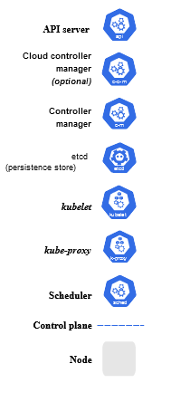

# Kubernetes Zero To Pro ✨

<br>

## **Valuable** `Links` 🔗

* ***[kubernetes concepts](https://kubernetes.io/docs/concepts/)***

* ***[Certified Kubernetes Application Developer](https://www.cncf.io/certification/ckad/)***
  * [Candidate Handbook](https://www.cncf.io/certification/candidate-handbook)

  * [Exam Tips](https://docs.linuxfoundation.org/tc-docs/certification/tips-cka-and-ckad)

  * Keep the code - **DEVOPS15** - handy while registering for the **CKA** or **CKAD** exams at *Linux Foundation* to get a **15% discount**.

<br>

## ***Kubernetes*** `Architecture` 🏗️

<br>

***Kubernetes coordinates a highly available cluster of computers that are connected to work as a single unit.***

<br>

 

<br/>

* The **`Control Plane`** is responsible for *managing the cluster*.

  * **Components**

    * `kube-apiserver` - Exposes the `Kubernetes API`
    * `etcd` - *Consistent and highly-available key value store* used as Kubernetes' backing store for all cluster data.
    * `kube-scheduler` - Watches for newly created `Pods` with no assigned `node`, and selects a `node` for them to run on.
    * `kube-controller-manager` - Runs `controller` processes. Each `controller` is a separate process but to keep things simple they are compiled together and run in a single process
      * Examples
        * `Node controller`: Responsible for noticing and responding when `nodes` go down.
        * `Job controller`: Watches for Job objects that represent one-off tasks, then creates `Pods` to run those tasks to **completion**.
        * `Endpoints controller`: Populates the Endpoints object (that is, joins Services & Pods).
        * `Service Account` & `Token controllers`: Create default accounts and `API` *access tokens* for new `namespaces`

    * `cloud-controller-manager` - Embeds cloud-specific control logic
      * `Node`, `Route`, and `Service controllers` can have cloud provider dependencies.

<br/>

* A `Node` is a `VM` or a *physical computer* that serves as a *worker machine* in a `Kubernetes` cluster.
  * The `nodes` communicate with the control plane using the `Kubernetes API`

  * **Components**
    * `kubelet` - An agent that runs on each node in the cluster. It makes sure that `containers` are running in a `Pod`.
      * `kube-proxy` - Network proxy that runs on each `node` in your cluster, implementing part of the *`Kubernetes` Service concept*.
    * `Container runtime` - **Software** that is *responsible for running* `containers`.

<br>

## ***Basic*** `Commands` 📝

<br>

## `minikube` **commands**

* Check the status of minikube

  ```bash
  minikube status
  ```

* *start* `minikube`

  ```bash
  minikube start
  ```

* **stop** `minikube`

  ```bash
  minikube stop
  ```

<br>

## `kubectl` **commands**

<br>

* **check** version of `kubernetes` being used

  ```bash
  kubectl version
  ```

* **get** *everything*

  ```bash
  kubectl get all
  ```

<br>

## `usefull` **commands**

<br>

* **view** the flavor and **version** of `OS`

  ```bash
  cat /etc/os-release
  ```

<br>

# ***YAML***

<br />

`YAML` is a ***human-readable data serialization language***. It is commonly used for *configuration files* and in applications where data is being stored or transmitted. `YAML` is stored in **key value pairs** and can be used to serialize data structures such as *maps, sequences, and scalars*.

<br>

## **Examples** *of* `Yaml`

<br />

* Key Value Pairs

  ```yaml
  Fruit: Apple
  Vegetable: Carrot
  Liquid: Water
  Meat: Chicken
  ```

* Array/Lists

  ```yaml
  Fruits:
    - Orange
    - Apple
    - Banana

  Vegetables:
    - Carrot 
    - Cauliflower
    - Tomato
  ```

* Dictionary/Map

  ```yaml
  Banana:
      Calories: 105
      Fat: 0.4g
      Carbs: 27g

  Grapes:
      Calories: 62
      Fat: 0.3g
      Carbs: 16g
  ```

* Key Value/Dictonary/Lists

  ```yaml
  Fruits:
    - Banana:
        Calories: 105
        Fat: 0.4g
        Carbs: 27g

    - Grapes:
        Calories: 62
        Fat: 0.3g
        Carbs: 16g
  ```

***Notice the alignment, this is important in yaml.***

* You can *either* set a value or a list/dictonary/map but *not both*

* `Dictionaries` are an *unordered collection* while `lists` are *ordered*

<br>

## `YAML` **Syntax**

* `YAML` is case sensitive
* Comments are created using the # symbol

<br>

# **Docker** 🐳

## ***Docker*** `Commands` *and* `Arguments`

<br>

**Examples**

<br>

* generic DOCKERFILE template

  ```Dockerfile
  FROM <image>
  RUN <command>
  CMD <command>
  ```

* commands template with parameters

  ```Dockerfile
  CMD command param
  CMD ["command", "param"]
  ```

* example command with arguments

  ```Dockerfile
  CMD sleep 5
  CMD ["sleep", "5"]
  ```

* makes a custom image of ubuntu and makes it sleep 5 seconds then exits

  ```Dockerfile
  FROM Ubuntu
  CMD sleep 5
  ```

* makes a custom image of ubuntu and makes it sleep from passed in param in entrypoint
  * entrypoint is the command that is run when the container is started

  ```Dockerfile
  FROM Ubuntu
  ENTRYPOINT ["sleep"]
  ```

* makes a custom image of ubuntu and makes it sleep from passed in param in entrypoint with default of 5 seconds

  ```Dockerfile
  FROM Ubuntu
  ENTRYPOINT ["sleep"]
  CMD ["5"]
  ```

  * you can override the entrypoint command with the --entrypoint flag

<br>

## ***Docker*** `Security`

<br>

* to run docker as a non-root user

  ```bash
  docker run --user=<user id> <image>
  ```

* users can also be defined in the dockerfile

  ```Dockerfile
  FROM ubuntu
  USER <user id>
  ```
